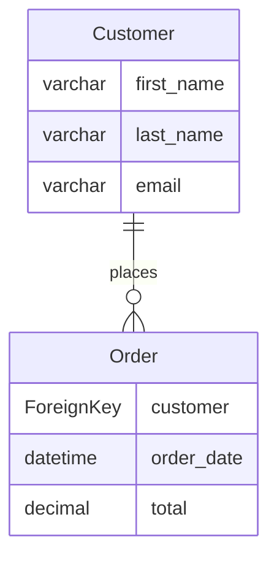
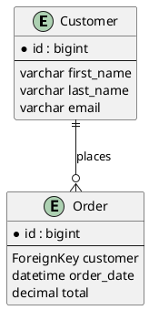

# ERD Generation

Generate Entity-Relationship Diagrams from your Django models.

## Basic Usage

```bash
python manage.py generate_erd -d mermaid
```

## Options

| Option | Description | Example |
|--------|-------------|---------|
| `-a APPS` | Filter by specific apps | `-a shopping,polls` |
| `-d DIALECT` | Output format | `-d mermaid`, `-d plantuml`, `-d dbdiagram` |
| `-o OUTPUT` | Output file path | `-o erd.md` |

## Output Formats

### Mermaid.js

Best for: GitHub README files, documentation sites

```bash
python manage.py generate_erd -d mermaid -o erd.md
```

Output:


### PlantUML

Best for: Detailed diagrams, enterprise documentation

```bash
python manage.py generate_erd -d plantuml -o erd.puml
```

Output:


### dbdiagram.io

Best for: Database design, quick prototyping

```bash
python manage.py generate_erd -d dbdiagram -o erd.txt
```

Output:
```dbml
Table Customer {
  id bigint [pk]
  first_name varchar
  last_name varchar
  email varchar
}

Table Order {
  id bigint [pk]
  customer bigint [ref: > Customer.id]
  order_date datetime
  total decimal
}

Ref: Order.customer > Customer.id
```

## App Filtering

Include only specific apps:

```bash
python manage.py generate_erd -a auth,shopping -d mermaid
```

Exclude apps by not listing them in the `-a` parameter.

## Integration with Documentation

### GitHub README

1. Generate ERD:
   ```bash
   python manage.py generate_erd -d mermaid -o docs/erd.md
   ```

2. Add to README:
   ```markdown
   ## Database Schema

   ```mermaid
   ```mermaid
   # Paste content from erd.md
   ```
   ```

### MkDocs Integration

Add to your docs folder and reference in mkdocs.yml:

```yaml
nav:
  - Database Schema: erd.md
```

## Tips

- Use `-d mermaid` for GitHub-compatible diagrams
- Use `-d plantuml` for complex schemas
- Use `-d dbdiagram` for database design collaboration
- Save output to files for version control
- Regenerate ERDs after model changes
