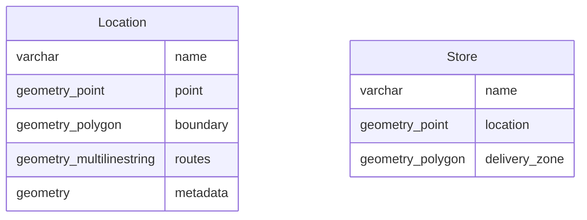
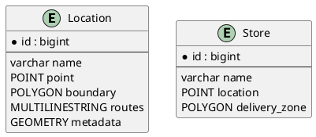

# GIS Fields Support

Django ERD Generator supports GeoDjango GIS field types for spatial data modeling.

## Setup

Enable GIS support in your Django project:

```python
# settings.py
INSTALLED_APPS = [
    # ...
    "django.contrib.gis",
    "django_erd_generator",
]
```

## Supported GIS Fields

| Field Type | Description | Mermaid Type | PlantUML Type |
|------------|-------------|--------------|---------------|
| `PointField` | Point coordinates | `geometry_point` | `POINT` |
| `LineStringField` | Line/path geometries | `geometry_linestring` | `LINESTRING` |
| `PolygonField` | Area/region geometries | `geometry_polygon` | `POLYGON` |
| `MultiPointField` | Collection of points | `geometry_multipoint` | `MULTIPOINT` |
| `MultiLineStringField` | Collection of lines | `geometry_multilinestring` | `MULTILINESTRING` |
| `MultiPolygonField` | Collection of polygons | `geometry_multipolygon` | `MULTIPOLYGON` |
| `GeometryCollectionField` | Mixed geometries | `geometry_collection` | `GEOMETRYCOLLECTION` |
| `GeometryField` | Generic geometry | `geometry` | `GEOMETRY` |
| `RasterField` | Raster/image data | `geometry_raster` | `RASTER` |

## Example Model

```python
from django.contrib.gis.db import models

class Location(models.Model):
    name = models.CharField(max_length=100)
    point = models.PointField()
    boundary = models.PolygonField()
    routes = models.MultiLineStringField()
    metadata = models.GeometryField()  # Generic geometry

class Store(models.Model):
    name = models.CharField(max_length=100)
    location = models.PointField()
    delivery_zone = models.PolygonField()
```

## Generated Output

### Mermaid.js



### PlantUML



## Use Cases

- **Mapping applications**: Store locations, boundaries, routes
- **Geofencing**: Define delivery zones, service areas
- **Spatial analysis**: Geographic relationships and queries
- **Real estate**: Property boundaries, lot sizes
- **Logistics**: Route planning, delivery zones

## Requirements

- Django with GeoDjango support
- PostGIS database (for production)
- GEOS and GDAL libraries installed

## Notes

- GIS fields require a spatial database backend
- Use `from django.contrib.gis.db import models` instead of `from django.db import models`
- All standard Django field types work alongside GIS fields
