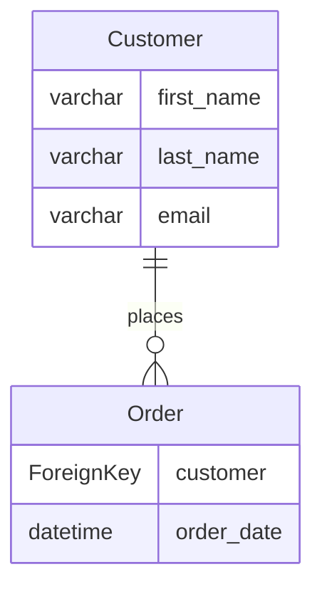
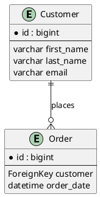

# Supported Dialects

Compare the three supported ERD output formats.

## Mermaid.js

**Best for:** GitHub READMEs, web documentation, quick sharing

### Pros
- Native GitHub support
- No external tools needed
- Easy to edit in markdown
- Live preview in browsers

### Cons
- Limited styling options
- Simpler diagram syntax

### Example


### Usage
```bash
python manage.py generate_erd -d mermaid -o erd.md
```

## PlantUML

**Best for:** Enterprise documentation, detailed diagrams, printing

### Pros
- Highly customizable
- Professional output
- Many export formats (PNG, SVG, PDF)
- Rich relationship notation

### Cons
- Requires PlantUML server or local installation
- Steeper learning curve

### Example


### Usage
```bash
python manage.py generate_erd -d plantuml -o erd.puml
```

## dbdiagram.io

**Best for:** Database design, collaboration, SQL generation

### Pros
- Interactive web editor
- SQL export capability
- Team collaboration
- Database schema validation

### Cons
- Requires internet connection for web tool
- Proprietary platform

### Example
```dbml
Table Customer {
  id bigint [pk]
  first_name varchar
  last_name varchar
  email varchar [unique]
}

Table Order {
  id bigint [pk]
  customer bigint [ref: > Customer.id]
  order_date datetime
}

Ref: Order.customer > Customer.id
```

### Usage
```bash
python manage.py generate_erd -d dbdiagram -o erd.txt
```

## Comparison Table

| Feature | Mermaid.js | PlantUML | dbdiagram.io |
|---------|-----------|----------|--------------|
| **GitHub Support** | ✅ Native | ❌ Image only | ❌ Image only |
| **Customization** | Limited | High | Medium |
| **Export Formats** | SVG/PNG | PNG/SVG/PDF | PNG/SQL |
| **Learning Curve** | Low | Medium | Low |
| **Offline Use** | ✅ Yes | ✅ Yes | ❌ No |
| **Team Collaboration** | ❌ No | ❌ No | ✅ Yes |
| **SQL Generation** | ❌ No | ❌ No | ✅ Yes |

## Recommendation

- **Use Mermaid.js** for GitHub projects and README files
- **Use PlantUML** for enterprise documentation and printing
- **Use dbdiagram.io** for database design and team collaboration
