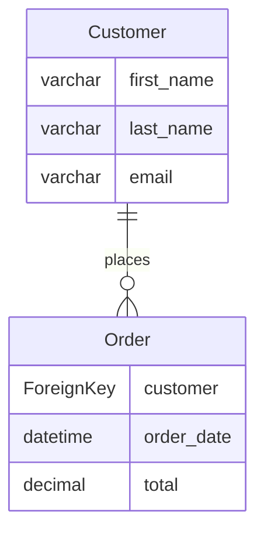

# Quickstart

Get started with Django ERD Generator in 5 minutes.

## Generate Your First ERD

### 1. Basic ERD Generation

Generate an ERD for all apps in Mermaid format:

```bash
python manage.py generate_erd -d mermaid
```

### 2. Save to File

Save the ERD to a file:

```bash
python manage.py generate_erd -d mermaid -o erd.md
```

### 3. Filter by Apps

Generate ERD for specific apps only:

```bash
python manage.py generate_erd -a shopping,polls -d mermaid
```

### 4. Different Formats

**Mermaid.js:**
```bash
python manage.py generate_erd -d mermaid -o erd.md
```

**PlantUML:**
```bash
python manage.py generate_erd -d plantuml -o erd.puml
```

**dbdiagram.io:**
```bash
python manage.py generate_erd -d dbdiagram -o erd.txt
```

## Generate Data Dictionary

Create comprehensive documentation:

```bash
python manage.py generate_data_dictionary -o docs/data_dictionary.md
```

## View in Browser

### Mermaid.js Live Editor

1. Generate ERD: `python manage.py generate_erd -d mermaid -o erd.md`
2. Copy the output
3. Paste into [Mermaid Live Editor](https://mermaid.live/)

### PlantUML Server

1. Generate ERD: `python manage.py generate_erd -d plantuml -o erd.puml`
2. Upload to [PlantUML Server](https://www.plantuml.com/plantuml/)

### dbdiagram.io

1. Generate ERD: `python manage.py generate_erd -d dbdiagram -o erd.txt`
2. Import into [dbdiagram.io](https://dbdiagram.io/)

## Example Output

### Sample Model

```python
from django.db import models

class Customer(models.Model):
    first_name = models.CharField(max_length=100)
    last_name = models.CharField(max_length=100)
    email = models.EmailField(unique=True)

class Order(models.Model):
    customer = models.ForeignKey(Customer, on_delete=models.CASCADE)
    order_date = models.DateTimeField(auto_now_add=True)
    total = models.DecimalField(max_digits=10, decimal_places=2)
```

### Generated Mermaid ERD



## Next Steps

- [Features](features/erd-generation.md) - Explore all capabilities
- [Supported Dialects](features/supported-dialects.md) - Compare output formats
- [Data Dictionary](features/data-dictionary.md) - Generate detailed documentation
